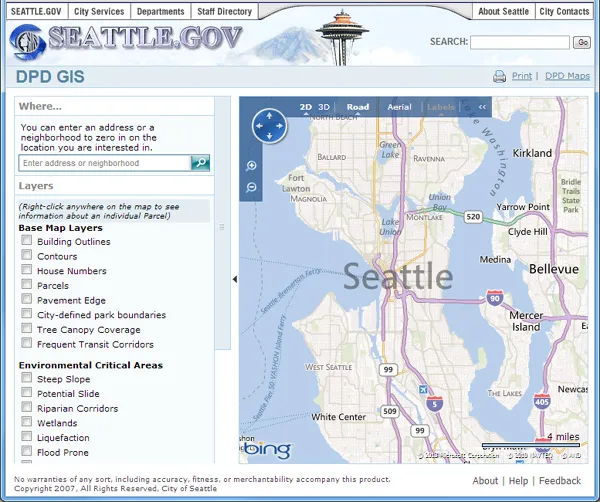
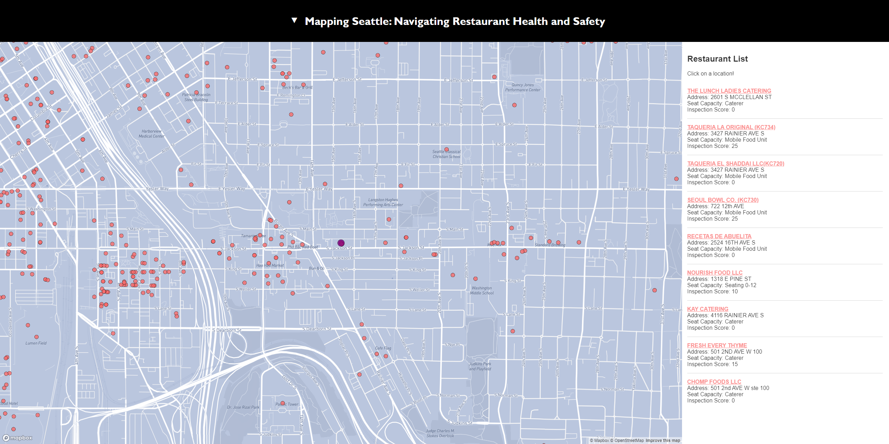

# Mapping Seattle: Navigating Restaurant Health and Safety
### Project Description/Goal
The goal of this project is to create a resource wherein users can easily view information about restaurants in Seattle. One of the important factors in deciding where to eat is how clean and safe the restaurant is. For this reason, King County inspects all businesses that serve food and assigns a score based on how safe it is to eat there. King County uses factors like food handling, equipment functionality, food temperature, storage area inspection, water temperature, and sanitizers to assure that food is being handled properly through the process of being prepared, all the way to being served. In this project, we will display a data set with health and safety information about restaurants throughout Seattle. Follow the below links to access our web app and data source. We include 4 different tabs: Index shows all restaurants, with an available hover to show more information. Score inspection shows restaurants by the inspection score they received. Violation shows which type of violation a restaurant received, if they received one. And risk shows what type of risk the restaurant potentially presents. Risk I is for limited food prep such as scooping ice cream or heating prepackaged food. Risk II is for food processing, things like receiving, storing, and preparing food. Risk II can also include on sit baking or grilling sandwiches. Risk II includes grocery stores that sell prepacked raw meat. Risk III is for most restaurants, things that involve all of risk II, but adds more preparation like cutting, cooking, hot holding, and reheating. This risk level includes most restaurants as well as food trucks and most meat and seafood markets. The intention with this application is to let the user explore restaurants or markets they may eat at to see what they can expect. For example, you can pick a restaurant to see what its seating capacity is, what score it got on inspection, what level of food prep is done, and if there were any health code violations that came up during inspection.
 
[Link to app](https://kkenohh.github.io/mapping_seattle/index.html)
 
[Link to data](https://gis-kingcounty.opendata.arcgis.com/datasets/kingcounty::restaurant-inspections-restaurant-inspections-point/explore?location=47.449024%2C-121.952400%2C10.87)
 
### Screenshots From Proposal

 
### Screenshots From Project

 
### Main Functions and Applied Libraries
This web app uses javascript as an operative backbone, using functions that access the Mapbox API to create a basemap, as well as functions to provide information about points upon user interaction.
To construct this app we used: Mapbox gl js API for creating a custom basemap and building out the functionality of the app. We used GitHub for version control and deployment. Our data comes from king county's open GIS portal. We used information about restaurants in Seattle and the reports from the most recent inspection of each restaurant.
 
### Acknowledgments
[Primary Data Source](https://gis-kingcounty.opendata.arcgis.com/datasets/kingcounty::restaurant-inspections-restaurant-inspections-point/explore?location=47.448486%2C-121.952400%2C10.87)
 
[Tutorial on Custom Basemap](https://www.e-education.psu.edu/geog865/node/325)
 
[Filter example](https://docs.mapbox.com/mapbox-gl-js/example/filter-markers/)
 
[Description of Risk Levels](https://kingcounty.gov/en/legacy/depts/health/environmental-health/food-safety/food-business-permit/risk-levels-permit-classifications)
 
[Sort data by Distance: Part I](https://docs.mapbox.com/help/tutorials/building-a-store-locator/)
 
[Sort data by Distance: Part II](https://docs.mapbox.com/help/tutorials/geocode-and-sort-stores/)